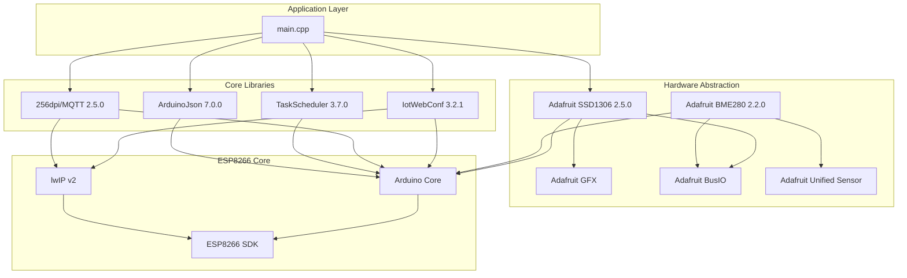

# Dependency Graph

## External Dependencies

## Dependency Details

### IotWebConf 3.2.1

| Dependency | Version | Purpose |
|------------|---------|---------|
| ESP8266WebServer | bundled | HTTP server |
| DNSServer | bundled | Captive Portal DNS |
| EEPROM | bundled | Configuration storage |

### TaskScheduler 3.7.0

| Dependency | Version | Purpose |
|------------|---------|---------|
| Arduino.h | bundled | millis(), yield() |

### Adafruit SSD1306 2.5.0

| Dependency | Version | Purpose |
|------------|---------|---------|
| Adafruit GFX | bundled | Graphics primitives |
| Adafruit BusIO | bundled | I2C abstraction |
| Wire | bundled | I2C communication |

### 256dpi/MQTT 2.5.0

| Dependency | Version | Purpose |
|------------|---------|---------|
| Client | bundled | TCP client abstraction |
| lwmqtt | bundled | Lightweight MQTT implementation |

## Memory Impact by Dependency

| Library | RAM | Flash |
|---------|-----|-------|
| IotWebConf | 4-8KB | ~50KB |
| TaskScheduler | ~500B | ~5KB |
| ArduinoJson | 1KB/block | ~15KB |
| MQTT | 1.5-3KB | ~20KB |
| Adafruit SSD1306 | 1KB (framebuffer) | ~10KB |
| Adafruit BME280 | ~300B | ~5KB |
| **Total** | ~8-13KB | ~105KB |

## Conflict History

| Conflict | Libraries | Resolution |
|----------|-----------|------------|
| Exception 28/29 | PubSubClient + IotWebConf | Use 256dpi/MQTT instead |
| Memory exhaustion | ArduinoJson + WiFi | Use direct String for WiFi scan |
| I2C conflicts | Multiple I2C devices | Shared bus with different addresses |

## Dependency Selection Rationale

| Library | Alternative | Reason for Selection |
|---------|-------------|---------------------|
| IotWebConf | WiFiManager | Non-blocking, TaskScheduler compatible |
| 256dpi/MQTT | PubSubClient | No exception conflicts with IotWebConf |
| TaskScheduler | FreeRTOS | Lower overhead, ESP8266 yield() compatible |
| LittleFS | SPIFFS | SPIFFS deprecated, better performance |

---

Generated: 2026-02-28
