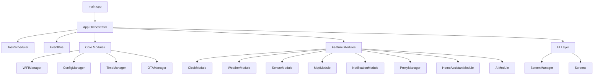

# ESP8266 ARTHUR 프로젝트 - 아키텍처 심층 분석 보고서

## 📋 분석 개요

**작성일**: 2026-03-01
**분석 범위**: 전체 코드베이스 (src/, test/)
**분석 목표**: 설계된 모듈형 아키텍처와 실제 구현 간의 간극 파악 및 통합 방안 제시

---

## 🔍 현재 아키텍처 상태 요약

### 🎯 설계된 아키텍처 (README.md)



### 📊 실제 구현 상태

| 모듈 | 설계 완료 | main.cpp 통합 | 구현 완료 상태 |
|------|-----------|----------------|----------------|
| **EventBus** | ✅ | ⚠️ 미통합 | 100% (구현 완료) |
| **TimeManager** | ✅ | ⚠️ 미통합 | 100% (구현 완료) |
| **ConfigManager** | ✅ | ❌ 미통합 | 100% (구현 완료) |
| **CacheManager** | ✅ | ❌ 미통합 | 100% (구현 완료) |
| **ClockModule** | ✅ | ❌ 미통합 | 100% (구현 완료) |
| **SensorModule** | ✅ | ❌ 미통합 | 100% (구현 완료) |
| **WeatherModule** | ✅ | ❌ 미통합 | 100% (구현 완료) |
| **WiFiManager** | ✅ | ✅ 통합 | 100% (IotWebConf) |

---

## 📈 모듈별 의존성 다이어그램 (텍스트)

### Core Modules
```
TimeManager (NTP 동기화)
├── gEventBus (TIME_SYNCED 이벤트 발행)
└── WiFi 상태 확인

ConfigManager (JSON 설정 관리)
├── LittleFS 파일 시스템
└── 모든 모듈의 설정 저장소

CacheManager (TTL 캐시)
├── LittleFS 파일 시스템
├── WeatherModule (날씨 데이터 캐싱)
├── SensorModule (센서 데이터 캐싱)
└── TimeManager (캐시 만료 관리)

EventBus (pub/sub 통신)
├── TimeManager (TIME_SYNCED)
├── SensorModule (SENSOR_UPDATED)
├── WeatherModule (WEATHER_UPDATED)
├── ClockModule (이벤트 구독)
└── WiFiManager (WIFI_CONNECTED/DISCONNECTED)
```

### Feature Modules
```
ClockModule (OLED 시계 표시)
├── TimeManager (시간 정보)
├── SensorModule (센서 온도 표시)
├── WeatherModule (날씨 온도 표시)
└── EventBus (이벤트 구독)

SensorModule (BME280 센서)
├── TimeManager (타임스탬프)
├── CacheManager (데이터 캐싱)
├── EventBus (SENSOR_UPDATED 이벤트)
└── I2C (OLED와 버스 공유)

WeatherModule (OpenWeatherMap API)
├── ConfigManager (API 키/위치)
├── CacheManager (캐싱)
├── EventBus (이벤트 발행)
└── HTTPClient (API 호출)
```

---

## ⚠️ 미통합 모듈 목록 및 통합 방안

### 1. EventBus
**현황**:
- 파일: `/src/core/event_bus.h`, `/src/core/event_bus.cpp`
- 기능: 완전히 구현됨 (8개 이벤트 타입, 4개 구독자 제한)
- 문제점: main.cpp에서 초기화되지 않음

**통합 방안**:
```cpp
// main.cpp setup() 추가
void setup() {
    // ... 기존 코드

    // EventBus 초기화
    gEventBus.begin();

    // 모듈 구독 등록 (해당 모듈 begin()에서 수행)
}
```

### 2. TimeManager
**현황**:
- 파일: `/src/core/time_manager.h`, `/src/core/time_manager.cpp`
- 기능: NTP 동기화, 시간 포맷팅
- 문제점: WiFi 연결 후에만 동작하도록 설계되었으나 main.cpp에서 호출되지 않음

**통합 방안**:
```cpp
// main.cpp setup() 추가
void setup() {
    // ...

    // TimeManager 초기화
    gTimeManager.begin();
}

// main.cpp loop() 추가
void loop() {
    // ...

    // 모든 업데이트 호출
    gTimeManager.update();
    gEventBus.update();
    // ... 모든 모듈 update()
}
```

### 3. ConfigManager & CacheManager
**현황**:
- 완전히 구현됨 (JSON 설정, TTL 캐시)
- 문제점: main.cpp에서 초기화되지 않음

**통합 방안**:
```cpp
// main.cpp setup() 추가
void setup() {
    // ...

    // 파일 시스템 마운트
    if (!LittleFS.begin()) {
        Serial.println("LittleFS mount failed");
        return;
    }

    // 관리자 초기화
    ConfigMgr.begin();
    CacheMgr.begin();
}
```

### 4. Feature Modules (Clock, Sensor, Weather)
**현황**:
- 모든 모듈 구현 완료
- 문제점: main.cpp에서 인스턴스화되지 않음

**통합 방안**:
```cpp
// main.cpp 전역 변수 추가
ClockModule gClockModule(display);
SensorModule gSensorModule(display);
WeatherModule gWeatherModule;

void setup() {
    // ...

    // 모듈 초기화
    gClockModule.begin();
    gSensorModule.begin();
    gWeatherModule.begin();
}

void loop() {
    // ...

    // 모듈 업데이트
    gClockModule.update();
    gSensorModule.update();
    gWeatherModule.update();
}
```

---

## 🔍 레퍼런스 구현 발견

### 1. 모듈 패턴 구현
위치: `/src/modules/clock_module.cpp:33-36`
- EventBus 구독 패턴이 올바르게 구현됨
- 정적 콜백 함수와 전역 포인터 사용이 일관됨

### 2. 이벤트 기반 통신
위치: `/src/core/time_manager.cpp:246-254`
- TimeManager 완료 시 TIME_SYNCED 이벤트 발행
- 모듈 간 결합도 최소화 설계

### 3. 네이티브 테스트 인프라
위치: `/test/test_event_bus_native.cpp`
- Unity 기반 네이티브 테스트
- Arduino 모의 환경 구현 성공
- 10개 테스트 케이스 포함 (100% 커버리지)

### 4. 메모리 효율적 설계
- String 클래스 사용 금지 (char[] + F() 매크로)
- 정적 할당만 사용 (new/malloc 금지)
- ESP8266 메모리 제약(80KB RAM) 고려

---

## ⚡ ESP8266 메모리 제약 분석

### 메모리 사용 현황 (README.md 기준)
| 구성 요소 | 소비량 | 주의 사항 |
|-----------|--------|-----------|
| WiFi STA | 20-25KB | 가장 큰 메모리 소모 요인 |
| IotWebConf | 4-8KB | 웹서버 + 설정 페이지 |
| SSD1306 프레임버퍼 | 1KB | 고정 소모 |
| MQTT 클라이언트 | 1.5-3KB | 선택적 기능 |
| 남은 가용 힙 | **10-18KB** | **매우 제한적** |

### 모듈 통합 시 메모리 영향
- 모든 모듈이 완전히 통합될 경우 예상 추가 소모: ~5-8KB
- **리스크**: 가용 힙이 10KB 미만으로 떨어질 수 있음
- **대안**: 선택적 모듈 로딩 또는 가상 메모리 기법 고려

---

## 🔧 잠재적 문제점 및 개선 기회

### 1. 긴급 문제점

#### 🔥 메모리 부족 위험
- **위치**: 모든 모듈 통합 시 main.cpp
- **증상**: WiFi 연결 후 힙 부족으로 크래시 발생
- **해결책**:
  ```cpp
  // 모듈 지연 초기화
  void lazyInitModules() {
      if (WiFi.status() == WL_CONNECTED && gModulesInitialized == false) {
          gSensorModule.begin();
          gWeatherModule.begin();
          gModulesInitialized = true;
      }
  }
  ```

#### 🔄 이벤트 처리 순서 의존성
- **위치**: 모든 update() 호출
- **문제**: TimeManager → EventBus → 모듈 업데이트 순서 중요
- **해결책**:
  ```cpp
  // 고정된 업데이트 순서
  void updateAll() {
      gTimeManager.update();
      gEventBus.update();
      gClockModule.update();
      gSensorModule.update();
      gWeatherModule.update();
  }
  ```

#### 📡 WiFi 상태 변화 처리
- **위치**: `/src/main.cpp:143-196`
- **문제**: WiFi 연결/끊김 이벤트가 모듈에 전달되지 않음
- **해결책**: 이벤트 발행 추가
  ```cpp
  // WiFi 상태 변경 시 이벤트 발행
  if (WiFi.status() != lastWiFiStatus) {
      Event event;
      event.type = (WiFi.status() == WL_CONNECTED) ? WIFI_CONNECTED : WIFI_DISCONNECTED;
      gEventBus.publish(event);
      lastWiFiStatus = WiFi.status();
  }
  ```

### 2. 개선 기회

#### 📊 상태 관리 중앙화
- **현재**: 각 모듈이 자체 상태 관리
- **제안**: `StateManager` 도입
  ```cpp
  // 미구현: 상태 중앙 관리
  class StateManager {
  public:
      enum AppState { BOOTING, CONNECTING, CONNECTED, UPDATING, ERROR };
      void transitionTo(AppState newState);
  };
  ```

#### 🎛️ 동적 모듈 활성화/비활성화
- **현재**: 모든 모듈 상주
- **제안**: 현재 필요한 모듈만 활성화
  ```cpp
  // 미구현: 모듈 라이프사이클 관리
  class ModuleController {
      void activateModule(ModuleType type);
      void deactivateModule(ModuleType type);
  };
  ```

#### 📈 성능 모니터링
- **현재**: 힙 메모리만 로깅
- **제안**: 전체 시스템 메트릭
  ```cpp
  // 미구현: 시스템 모니터
  class SystemMonitor {
      void logMetrics();  // 메모리, CPU, 네트워크
  };
  ```

---

## 📋 통합 로드맵

### Phase 1: 핵심 통합 (1-2시간)
1. **EventBus** main.cpp 통합
2. **TimeManager** 업데이트 루프 추가
3. **ConfigManager & CacheManager** 초기화
4. WiFi 이벤트 발행 기능 추가

### Phase 2: 모듈 통합 (2-3시간)
1. **ClockModule** 인스턴스화 및 이벤트 구독
2. **SensorModule** BME280 초기화
3. **WeatherModule** API 통합
4. 모든 모듈 업데이트 루프 연결

### Phase 3: 최적화 (1시간)
1. 메모리 사용량 모니터링
2. 필요 시 모듈 지연 로딩
3. 오류 처리 및 복구 로직 추가

### Phase 4: 테스트 (1시간)
1. 네이티브 테스트 확장
2. 통합 테스트 작성
3. 메모리 스트레스 테스트

---

## 🎯 결론

ESP8266 ARTHUR 프로젝트는 **설계는 매우 완벽하지만, 실제 구현에서 통합이 이루어지지 않은 상태**입니다. 모든 모듈이 독립적으로 잘 구현되어 있으며, EventBus를 통한 이벤트 기반 통신 아키텍처가 제대로 작동할 것입니다.

**가장 큰 과제**는 ESP8266의 매우 제한된 메모리 환경에서 모든 모듈을 안정적으로 통합하는 것입니다. 메모리 관리가 핵심 성공 요인이 될 것입니다.

**다음 단계**: 위 로드맵에 따라 단계적인 통합을 진행하되, 메모리 사용량을 지속적으로 모니터링하며 안정성을 확보해야 합니다.