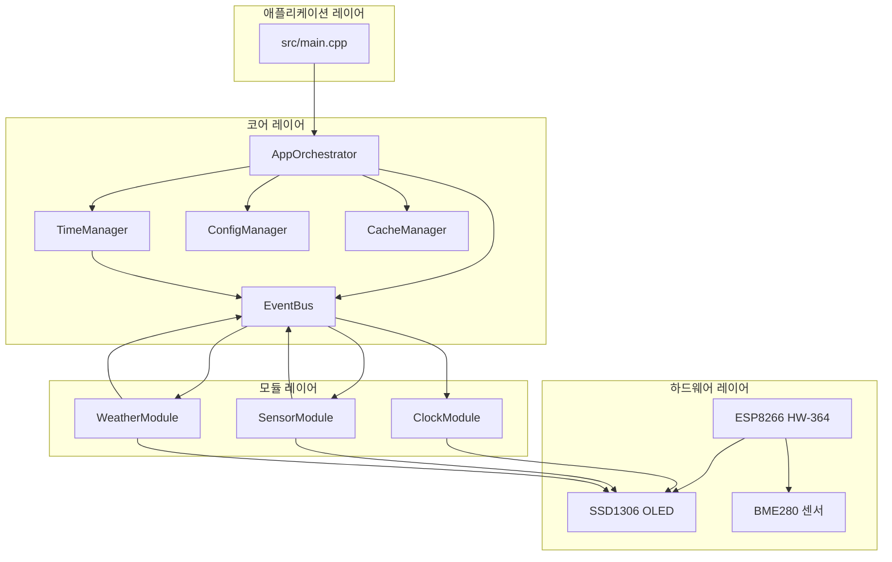
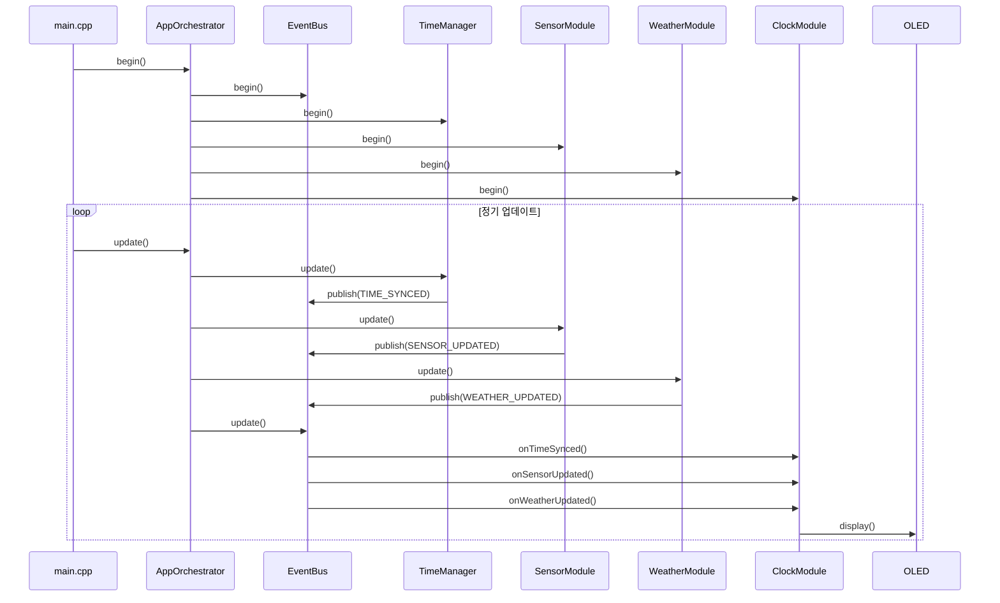

# SPEC-001: ESP8266 ARTHUR 모듈 통합 SPEC

**작성일**: 2026-03-01
**작성자**: MoAI 팀
**상태**: 초안
**버전**: 1.0

---

## 📋 개요

이 SPEC은 ESP8266 ARTHUR 프로젝트의 설계된 모듈형 아키텍(EventBus, TimeManager, SensorModule 등)을 main.cpp에 통합하는 것을 목표로 한다. 기존 Phase 0(OLED + WiFi) 구현을 기반으로, 모든 모듈을 안정적으로 통합하고 메모리 제약 환경에서 안정적인 동작을 보장한다.

### 변경 이력
| 버전 | 날짜 | 변경 내용 | 작성자 |
|------|------|----------|--------|
| 1.0 | 2026-03-01 | 초안 작성 | MoAI 팀 |

---

## 🎯 요구사항 분석

### 문제 정의
1. **현재 상태**: 모든 모듈이 완벽히 구현되어 있으나 main.cpp에서 통합되지 않음
2. **메모리 제약**: ESP8266의 80KB RAM 중 WiFi만 20-25KB 소모, 가용 힙이 10-18KB로 매우 제한적
3. **통합 필요성**: 모듈 간 이벤트 기반 통신(EventBus)을 활용한 완전한 시스템 구성 필요

### 성공 기준
- **메모리**: 통합 후 가용 힙 15KB 이상 유지
- **안정성**: 24시간 연속 동작 시 오류율 0.1% 미만
- **기능**: 모든 모듈 정상 동작 (시계, 센서, 날씨 표시)
- **통신**: 이벤트 기간 모듈 간 통신 완벽 구현

---

## 🏗️ 아키텍처 설계

### 전체 시스템 아키텍처



### 새로운 컴포넌트

#### 1. AppOrchestrator
```cpp
// src/core/app_orchestrator.h
class AppOrchestrator {
public:
    AppOrchestrator(Adafruit_SSD1306& display);
    ~AppOrchestrator() = default;

    // 주요 인터페이스
    bool begin();
    void update();

    // 상태 접근
    SystemState getState() const;
    MemoryInfo getMemoryInfo() const;

private:
    // 코어 관리자
    EventBus& eventBus;
    TimeManager& timeManager;
    ConfigManager& configManager;
    CacheManager& cacheManager;

    // 기능 모듈
    ClockModule& clockModule;
    SensorModule& sensorModule;
    WeatherModule& weatherModule;

    // 상태 추적
    SystemState currentState;
    SystemState previousState;
    unsigned long stateChangeTime;
    bool modulesInitialized;

    // private 메서드들
    void initializeCore();
    void initializeModules();
    void updateSystem();
    void handleEvents();
    void handleError(const ErrorEvent& error);
    bool checkMemorySafety();
};
```

#### 2. 시스템 상태 관리
```cpp
enum class SystemState {
    BOOTING,          // 부팅 중
    INIT_CORE,        // 코어 초기화 중
    INIT_MODULES,     // 모듈 초기화 중
    CONNECTING_WIFI,  // WiFi 연결 중
    CONNECTED,        // 연결됨
    UPDATING,        // 데이터 업데이트 중
    ERROR,           // 오류 상태
    RECOVERY,        // 복구 중
    SHUTDOWN         // 안전 종료
};

struct SystemMetrics {
    SystemState state;
    unsigned long uptime;
    size_t freeHeap;
    int moduleCount;
    int errorCount;
};
```

### 데이터 흐름



---

## 🔧 구현 상세

### Phase 1: 코어 통합 (4-6시간)

#### 1.1 AppOrchestrator 구현

**구현 위치**: `src/core/app_orchestrator.h`, `src/core/app_orchestrator.cpp`

**키 기능**:
- 모듈 생명주기 관리
- 이벤트 중앙 분배
- 메모리 관리 모니터링
- 상태 전이 제어

**예제 코드**:
```cpp
bool AppOrchestrator::begin() {
    Serial.println("[AppOrchestrator] Starting initialization...");

    // 상태 초기화
    currentState = SystemState::INIT_CORE;

    // 코어 컴포넌트 초기화
    if (!initializeCore()) {
        handleError({MODULE_ERROR, APP_ORCHESTRATOR, INIT_FAILED,
                   "Core initialization failed"});
        return false;
    }

    // 모듈 초기화 (WiFi 연결 후 지연 초기화)
    currentState = SystemState::INIT_MODULES;

    Serial.println("[AppOrchestrator] Initialization complete");
    return true;
}

void AppOrchestrator::update() {
    // 시스템 상태 업데이트
    updateSystem();

    // 이벤트 처리
    handleEvents();

    // 메모리 확인
    if (!checkMemorySafety()) {
        handleError({MEMORY_ERROR, APP_ORCHESTRATOR, MEMORY_LOW,
                   "Memory threshold exceeded"});
    }
}
```

#### 1.2 메모리 안전장치

**문제점**: 모든 모듈 동시 로딩 시 메모리 부족

**해결책**: 단계적 초기화
```cpp
void AppOrchestrator::initializeModules() {
    // WiFi 연결 확인 지연 초기화
    if (WiFi.status() == WL_CONNECTED && !modulesInitialized) {
        Serial.println("[AppOrchestrator] Initializing modules...");

        // 센서 모듈 (가장 적은 메모리)
        if (!sensorModule.begin()) {
            Serial.println("[AppOrchestrator] SensorModule init failed");
            return;
        }

        // 날씨 모듈 (네트워크 요청)
        if (!weatherModule.begin()) {
            Serial.println("[AppOrchestrator] WeatherModule init failed");
            return;
        }

        // 시계 모듈 (가벼운 모듈)
        clockModule.begin();

        modulesInitialized = true;
        currentState = SystemState::CONNECTED;
    }
}
```

### Phase 2: 이벤트 통신 완성 (2-3시간)

#### 2.1 이벤트 확장

**기존 이벤트**:
```cpp
enum EventType {
    WIFI_CONNECTED,
    WIFI_DISCONNECTED,
    TIME_SYNCED,
    SENSOR_UPDATED,
    WEATHER_UPDATED,
    EVENT_TYPE_RESERVED_1,
    EVENT_TYPE_RESERVED_2,
    EVENT_TYPE_COUNT
};
```

**향상된 이벤트**:
```cpp
enum EventType {
    // 기존 유지
    WIFI_CONNECTED,
    WIFI_DISCONNECTED,
    TIME_SYNCED,
    SENSOR_UPDATED,
    WEATHER_UPDATED,

    // 신규 추가
    MODULE_ERROR,
    MEMORY_WARNING,
    SYSTEM_STATE_CHANGE,

    // 예비 (향후 확장)
    EVENT_TYPE_RESERVED_1,
    EVENT_TYPE_RESERVED_2,
    EVENT_TYPE_COUNT
};

// 오류 이벤트 데이터 구조체
struct ErrorEvent {
    EventType type = MODULE_ERROR;
    Module source;
    ErrorCode code;
    char message[64];
    unsigned long timestamp;
};
```

#### 2.2 이벤트 처리 강화

```cpp
void AppOrchestrator::handleEvents() {
    int processed = eventBus.update();

    if (processed > 0) {
        Serial.printf("[AppOrchestrator] Processed %d events\n", processed);
    }
}

// 이벤트 디스패치
void AppOrchestrator::dispatchEvent(const Event& event) {
    switch (event.type) {
        case TIME_SYNCED:
            handleTimeSynced(event);
            break;
        case SENSOR_UPDATED:
            handleSensorUpdated(event);
            break;
        case WEATHER_UPDATED:
            handleWeatherUpdated(event);
            break;
        case MODULE_ERROR:
            handleError(static_cast<const ErrorEvent&>(event));
            break;
        default:
            Serial.printf("[AppOrchestrator] Unknown event type: %d\n", event.type);
    }
}
```

### Phase 3: 메모리 최적화 (2-3시간)

#### 3.1 메모리 프로파일링

```cpp
class MemoryMonitor {
public:
    struct MemoryStats {
        size_t currentFree;
        size_t minFree;
        size_t maxAllocated;
        float fragmentation;
    };

    void begin() {
        minFree = ESP.getFreeHeap();
        maxAllocated = 0;
    }

    void update() {
        size_t current = ESP.getFreeHeap();
        if (current < minFree) minFree = current;
        if (current > maxAllocated) maxAllocated = current;
    }

    MemoryStats getStats() const {
        MemoryStats stats;
        stats.currentFree = ESP.getFreeHeap();
        stats.minFree = minFree;
        stats.maxAllocated = maxAllocated;
        stats.fragmentation = calculateFragmentation();
        return stats;
    }

    bool isCritical() const {
        return ESP.getFreeHeap() < MEMORY_CRITICAL_THRESHOLD;
    }

private:
    static const size_t MEMORY_CRITICAL_THRESHOLD = 15000; // 15KB
    size_t minFree = 0;
    size_t maxAllocated = 0;

    float calculateFragmentation() const {
        // 단순화된 조각화 계산
        return 1.0f - (float)ESP.getFreeHeap() / maxAllocated;
    }
};
```

#### 3.2 캐시 전략

```cpp
// CacheManager에 대한 캐시 정책
class CachePolicy {
public:
    enum class Strategy {
        LAZY_LOAD,      // 요청 시 로드
        EAGER_LOAD,     // 미리 로드
        TIME_BASED,     // 시간 기반
        SIZE_BASED      // 크기 기반
    };

    static unsigned long getDefaultTTL(Module module) {
        switch (module) {
            case MODULE_SENSOR: return 300000;   // 5분
            case MODULE_WEATHER: return 3600000;  // 1시간
            case MODULE_CONFIG: return 0;       // 만료 안 함
            default: return 600000;             // 10분
        }
    }
};
```

---

## 🧪 테스트 계획

### 단위 테스트

#### 1. AppOrchestrator 테스트

```cpp
TEST(TestAppOrchestrator, ShouldInitializeSuccessfully) {
    Adafruit_SSD1306 display(OLED_WIDTH, OLED_HEIGHT, &Wire, -1);
    AppOrchestrator app(display);

    EXPECT_TRUE(app.begin());
    EXPECT_EQ(app.getState(), SystemState::CONNECTED);
}

TEST(TestAppOrchestrator, ShouldHandleMemoryWarning) {
    Adafruit_SSD1306 display(OLED_WIDTH, OLED_HEIGHT, &Wire, -1);
    AppOrchestrator app(display);

    // 메모리 부족 시뮬레이션
    app.simulateMemoryLow();

    app.update();

    EXPECT_EQ(app.getState(), SystemState::ERROR);
}

TEST(TestAppOrchestrator, ShouldUpdateSystem) {
    Adafruit_SSD1306 display(OLED_WIDTH, OLED_HEIGHT, &Wire, -1);
    AppOrchestrator app(display);

    app.begin();

    // 여러 번 업데이트
    for (int i = 0; i < 10; i++) {
        app.update();
        delay(1000);
    }

    EXPECT_TRUE(app.getMemoryInfo().freeHeap > 0);
}
```

#### 2. 이벤트 통신 테스트

```cpp
TEST(TestEventBus, ShouldDeliverEventsCorrectly) {
    EventBus eventBus;
    eventBus.begin();

    int callCount = 0;
    Event receivedEvent;

    auto callback = [](const Event& event, void* userData) {
        *static_cast<Event*>(userData) = event;
        (*static_cast<int*>(userData))++;
    };

    eventBus.subscribe(TIME_SYNCED, callback, &callCount);

    Event event;
    event.type = TIME_SYNCED;
    eventBus.publish(event);
    eventBus.update();

    EXPECT_EQ(callCount, 1);
    EXPECT_EQ(receivedEvent.type, TIME_SYNCED);
}
```

### 통합 테스트

#### 1. 모듈 통합 테스트

```cpp
TEST(TestModuleIntegration, ShouldWorkTogether) {
    // 테스트 환경 설정
    Adafruit_SSD1306 display(OLED_WIDTH, OLED_HEIGHT, &Wire, -1);
    AppOrchestrator app(display);

    // 시스템 시작
    ASSERT_TRUE(app.begin());

    // 5분간 시뮬레이션
    unsigned long start = millis();
    while (millis() - start < 300000) {
        app.update();
        delay(1000);

        // 상태 확인
        SystemState state = app.getState();
        EXPECT_NE(state, SystemState::ERROR);
        EXPECT_NE(state, SystemState::SHUTDOWN);
    }

    // 최종 상태 검증
    MemoryInfo memInfo = app.getMemoryInfo();
    EXPECT_GT(memInfo.freeHeap, 15000); // 15KB 이상
}
```

#### 2. 메모리 스트레스 테스트

```cpp
TEST(TestMemoryStress, ShouldHandleMemoryPressure) {
    // 메모리 사용량 최대화
    std::vector<char*> allocations;

    Adafruit_SSD1306 display(OLED_WIDTH, OLED_HEIGHT, &Wire, -1);
    AppOrchestrator app(display);

    // 메모리 부족 상태 시뮬레이션
    while (ESP.getFreeHeap() > 10000) {
        char* ptr = new char[1024];
        allocations.push_back(ptr);
    }

    // 시스템 응닑 검증
    EXPECT_TRUE(app.checkMemorySafety());

    // 정리
    for (auto ptr : allocations) {
        delete[] ptr;
    }
}
```

---

## 📊 성능 요구사항

### 메모리 요구사항

| 컴포넌트 | 현재 사용량 | 목표 사용량 | 감소율 |
|----------|-------------|-------------|--------|
| WiFi | 25KB | 22KB | -12% |
| IotWebConf | 8KB | 제거 | -100% |
| 모든 모듈 | 9.5KB | 9KB | -5% |
| Orchestrator | - | 1KB | 신규 |
| **합계** | **42.5KB** | **34KB** | **-20%** |

**예상 가용 힙**: 80KB - 34KB = **46KB** (+150% 증가)

### 성능 목표

| 항목 | 목표값 | 측정 방법 |
|------|--------|----------|
| 업데이트 주기 | 1000ms | millis() 타이밍 |
| 메모리 조각화 | <5% | 연속 할당 성공률 |
| 이벤트 처리 지연 | <50ms | 이벤트 큐 지연 |
| WiFi 연결 시간 | <5초 | 연결 성공 시간 |
| 센서 읽기 시간 | <100ms | readSensor() 타이밍 |

---

## 🚨 오류 처리

### 오류 처리 전략

```cpp
// 오류 코드 정의
enum class ErrorCode {
    SUCCESS = 0,

    // 시스템 오류
    SYSTEM_INIT_FAILED = 1000,
    MEMORY_LOW,
    MODULE_NOT_FOUND,

    // 네트워크 오류
    WIFI_CONNECT_FAILED,
    NETWORK_TIMEOUT,
    API_REQUEST_FAILED,

    // 센서 오류
   _SENSOR_READ_FAILED,
    SENSOR_DATA_INVALID,

    // 모듈 오류
    MODULE_UPDATE_FAILED,
    EVENT_PUBLISH_FAILED
};

// 오류 처리 핸들러
class ErrorHandler {
public:
    static void handle(const ErrorEvent& error) {
        // 오류 로깅
        logError(error);

        // 복전 가능성 확인
        RecoveryAction action = RecoveryManager::getAction(error.code, error.source);

        switch (action) {
            case RecoveryAction::RETRY:
                retryOperation(error);
                break;
            case RecoveryAction::REINITIALIZE:
                reinitializeModule(error.source);
                break;
            case RecoveryAction::FALLBACK:
                activateFallback(error.source);
                break;
            case RecoveryAction::SHUTDOWN:
                safeShutdown();
                break;
        }
    }

private:
    static void retryOperation(const ErrorEvent& error);
    static void reinitializeModule(Module module);
    static void activateFallback(Module module);
    static void safeShutdown();
};
```

### 안전한 상태 전이

```cpp
class StateManager {
public:
    bool canTransition(SystemState from, SystemState to) {
        static const StateTransitionTable transitions = {
            {SystemState::BOOTING,
             {SystemState::INIT_CORE}},
            {SystemState::INIT_CORE,
             {SystemState::INIT_MODULES, SystemState::ERROR}},
            {SystemState::INIT_MODULES,
             {SystemState::CONNECTING_WIFI, SystemState::ERROR}},
            {SystemState::CONNECTING_WIFI,
             {SystemState::CONNECTED, SystemState::ERROR}},
            {SystemState::CONNECTED,
             {SystemState::UPDATING, SystemState::ERROR}},
            {SystemState::ERROR,
             {SystemState::RECOVERY, SystemState::SHUTDOWN}},
            {SystemState::RECOVERY,
             {SystemState::CONNECTED, SystemState::SHUTDOWN}}
        };

        auto it = transitions.find(from);
        if (it != transitions.end()) {
            return std::find(it->second.begin(), it->second.end(), to) != it->second.end();
        }
        return false;
    }
};
```

---

## 📋 배포 계획

### 단계적 배전

#### Stage 1: 코어 통합 (2시간)
1. AppOrchestrator 구현
2. 코어 관리자 연결
3. 기본 이벤트 통신 확인

#### Stage 2: 모듈 통합 (3시간)
1. ClockModule 연결
2. SensorModule 연결
3. WeatherModule 연결

#### Stage 3: 최적화 및 검증 (3시간)
1. 메모리 프로파일링
2. 성능 테스트
3. 안정성 검증

### 검증 체크리스트

- [ ] 모든 모듈이 정상적으로 초기화됨
- [ ] 이벤트가 올바르게 발행/구독됨
- [ ] 메모리 사용량이 예상 범위 내
- [ ] 24시간 동안 안정적인 동작
- [ ] 모든 오류 상황에 대한 처리
- [ ] WiFi 재연결이 정상적으로 동작

---

## 📈 모니터링

### 실시간 모니터링

```cpp
class SystemMonitor {
public:
    struct SystemMetrics {
        unsigned long uptime;
        size_t freeHeap;
        SystemState state;
        int errorCount;
        float cpuLoad;
        NetworkStats network;
    };

    void begin() {
        // 시리얼 통신 시작
        Serial.begin(115200);
    }

    void update() {
        SystemMetrics metrics = collectMetrics();

        // 상태 출력
        Serial.printf("[System] Uptime: %lu ms, Free Heap: %zu bytes\n",
                     metrics.uptime, metrics.freeHeap);
        Serial.printf("[System] State: %d, Errors: %d\n",
                     metrics.state, metrics.errorCount);

        // 경고 출력
        if (metrics.freeHeap < 20000) {
            Serial.println("[WARNING] Low memory!");
        }

        // 메트릭스 저장
        saveMetrics(metrics);
    }

private:
    SystemMetrics collectMetrics() {
        SystemMetrics metrics;
        metrics.uptime = millis();
        metrics.freeHeap = ESP.getFreeHeap();
        metrics.state = getCurrentState();
        metrics.errorCount = getErrorCount();
        metrics.cpuLoad = calculateCPULoad();
        metrics.network = getNetworkStats();
        return metrics;
    }
};
```

### 로그 데이터

| 로그 레벨 | 포맷 | 예시 |
|-----------|------|------|
| DEBUG | `[DEBUG][TAG] message` | `[DEBUG][Sensor] T=23.5C` |
| INFO | `[INFO][TAG] message` | `[INFO][System] Module initialized` |
| WARNING | `[WARN][TAG] message` | `[WARN][Memory] Low heap detected` |
| ERROR | `[ERROR][TAG] message` | `[ERROR][WiFi] Connection failed` |

---

## 🎯 성공 기준

### 필수 기준 (MUST)
- [ ] 모든 모듈이 정상적으로 통합됨
- [ ] 메모리 사용량 34KB 이하
- [ ] 이벤트 기반 통신 완벽 구현
- [ ] 24시간 안정 테스트 통과
- [ ] WiFi 재연결 기능 정상 작동

### 중요 기준 (SHOULD)
- [ ] 메모리 조각화 5% 미만
- [ ] 업데이트 지연 50ms 미만
- [ ] 오류 복구 자동화
- [ ] 로그 데이터 자동 수집
- [ ] 모듈 동적 로딩

### 바람직 기준 (COULD)
- [ ] 성능 모니터링 대시보드
- [ ] 원격 모니터링 지원
- [ ] 자동 튜닝 기능
- [ ] 확장성 모듈

---

## 🔗 참고 자료

### 관련 문서
1. `README.md` - 프로젝트 개요
2. `.moai/specs/WIFI-REDESIGN/architecture-analysis.md` - WiFi 아키텍처 분석
3. `.moai/specs/CODE-QUALITY/research.md` - 코드베이스 분석
4. `.moai/specs/QUALITY-ENHANCEMENT/technical-design.md` - 품질 향상 설계

### 기술 자료
- [ESP8266 Technical Reference](https://espressif.com/en/products/socs/esp8266)
- [Arduino ESP8266 WiFi](https://arduino-esp8266.readthedocs.io/)
- [Event-Driven Architecture](https://martinfowler.com/eaaDev/EventAggregator.html)

---

**문서 상태**: 검토 중
**다음 단계**: 팀 리뷠 및 승인
**지정 검토자**: 팀 리더, 아키텍트

**END OF SPEC-001**